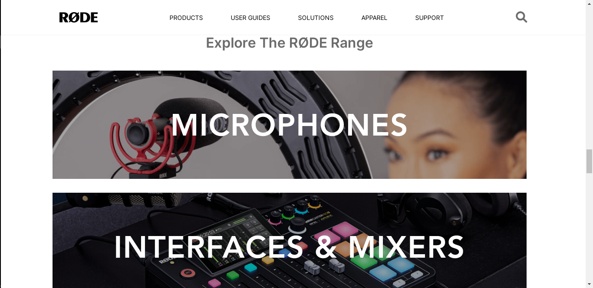
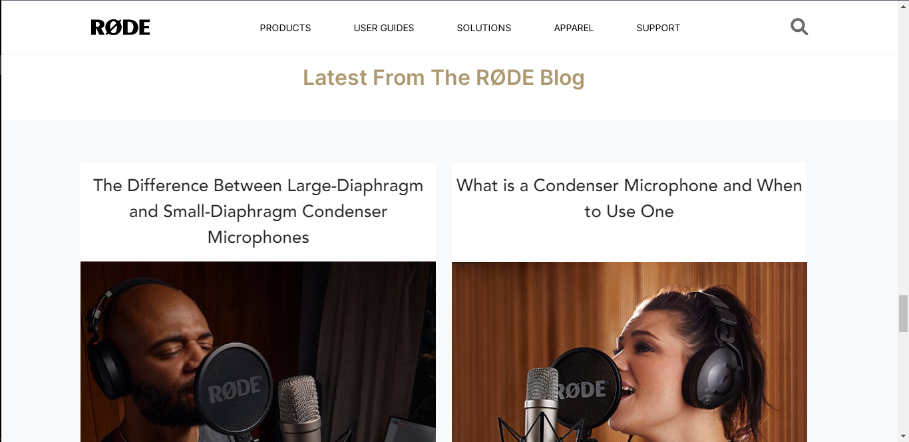
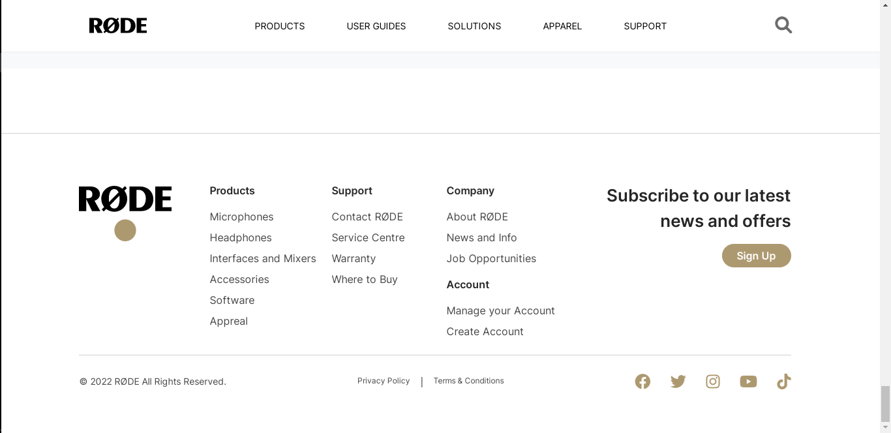
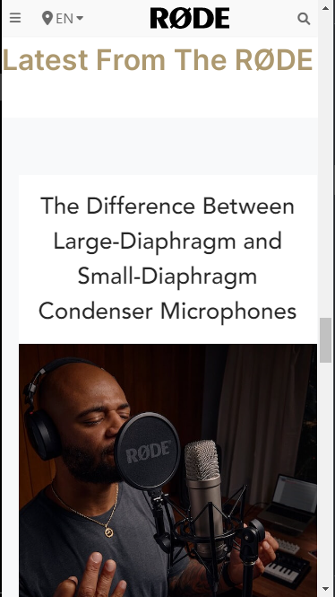

# Rode Frontend Clone

## This is the [Rode.com](https://rode.com/) frontend clone built using HTML & Tailwind CSS.

> This project helped me to learn and a understand Tailwind CSS. I Learned a lot about tailwind and group and other elements and i can build most of the web pages beautiful and responsive using this.

### Total time took to complete this project is 6-8 hours.

[Project Live Link Here](https://shopify-front-clone.netlify.app/)

## ScreenShots

